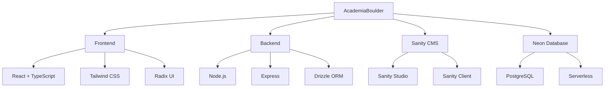
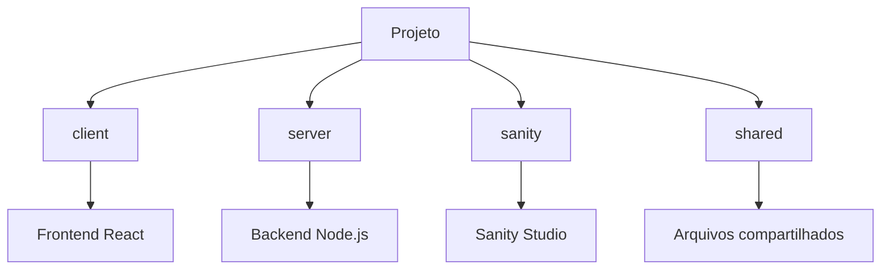

# AcademiaBoulder

Sistema de gerenciamento completo para academias e clubes de escalada, construído com tecnologias modernas e focado em experiência do usuário.

## 🚀 Tecnologias Utilizadas

- **Frontend**: React + TypeScript
- **Backend**: Node.js + TypeScript
- **Banco de Dados**: Neon (PostgreSQL Serverless)
- **CMS**: Sanity.io
- **UI**: Radix UI Components
- **Estilização**: Tailwind CSS

## 📊 Arquitetura do Projeto



## 📋 Requisitos

- Node.js 18+
- npm ou yarn
- Conta no Sanity.io
- Conta no Neon

## 🛠️ Instalação

1. Clone o repositório:
```bash
git clone <url-do-repositorio>
cd AcademiaBoulder
```

2. Instale as dependências:
```bash
npm install
```

3. Configure as variáveis de ambiente:
- Copie o arquivo `.env.example` para `.env`
- Preencha as variáveis necessárias:
  - DATABASE_URL
  - SANITY_PROJECT_ID
  - SANITY_DATASET
  - SANITY_API_TOKEN

4. Inicie o servidor de desenvolvimento:
```bash
npm run dev
```

## 📁 Estrutura do Projeto



## 📱 Funcionalidades Principais

- Gerenciamento completo de membros
- Sistema de check-in/check-out
- Agendamento de aulas
- Gestão de pagamentos
- Dashboard administrativo
- Integração com CMS para conteúdo

## 🚀 Scripts Disponíveis

- `npm run dev`: Inicia o servidor de desenvolvimento
- `npm run build`: Gera a build de produção
- `npm run start`: Inicia o servidor em produção
- `npm run check`: Verifica erros de TypeScript
- `npm run db:push`: Sincroniza o banco de dados

## 📝 Configuração do Banco de Dados

1. Crie uma conta no Neon
2. Configure a variável DATABASE_URL no arquivo .env
3. Execute as migrações:
```bash
npm run db:push
```

## 🎨 Estilização

O projeto utiliza Tailwind CSS para estilização. As configurações estão em `tailwind.config.ts`.

## 🔐 Segurança

- Autenticação JWT
- Validação de dados
- Proteção contra SQL Injection
- Rate limiting
- CORS configurado

## 🤝 Contribuição

1. Faça um fork do projeto
2. Crie uma branch para sua feature (`git checkout -b feature/AmazingFeature`)
3. Commit suas mudanças (`git commit -m 'Add some AmazingFeature'`)
4. Push para a branch (`git push origin feature/AmazingFeature`)
5. Abra um Pull Request

## 📄 Licença

Este projeto está sob a licença MIT. Veja o arquivo LICENSE para mais detalhes.

## 🙏 Agradecimentos

- Sanity.io por fornecer o CMS
- Neon por fornecer o banco de dados serverless
- Radix UI por fornecer componentes acessíveis
- Tailwind CSS por fornecer estilização moderna
